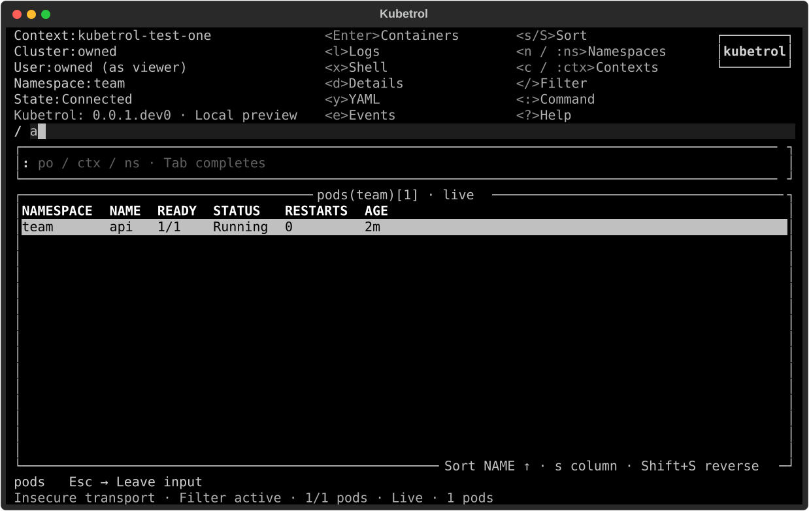

# F05 invocation connection and refresh acceptance

Issue: [#19](https://github.com/carloshm91/kubetrol/issues/19).
Contract: [CLI and effective connection](../k9s-cli.md#effective-invocation-connection).

The invocation request captures validated immutable connection overrides. The
catalogue derives per-client mappings without changing source configuration or
global SDK state. Reads, watches, logs and the private delegated kubectl snapshot
share the resulting endpoint, credentials, TLS material and impersonation.

## Behavioral evidence

- Unit cases exercise all scalar/boolean validation, exclusivity, captured
  paths, merged alias provenance, credential replacement, repeated group order,
  loaded UID/extras, encoded extra header names and the bounded header budget.
  The new deterministic override module belongs to the 100% critical inventory.
- Real owned HTTP requests exercise alternate endpoint/user selection, log and
  watch streams, duplicate groups, loaded UID/extras, reconnect cleanup and 401/403
  distinction. Shell staging checks the private 0600 snapshot and unchanged source
  configuration. An explicit token suppresses the replaced helper.
- Owned HTTPS servers qualify forced verification, explicit CA replacing invalid
  embedded material, explicit insecure transport, and mutual client-certificate
  authentication replacing the previous credential mechanism.
- Pilot checks the effective header identity, timed age changes during filtering,
  retained selection/focus, unchanged request count and session generation, and
  immediate watch updates even with a 3600-second repaint interval.
- Source and clean installed CLI terminals select alternate aliases, replace a
  wrong token, repeat impersonation groups, use refresh, reconnect through the
  context table and change namespace. The owned API checks actual headers. The
  PTY harness verifies terminal restoration and absence of token output.

Relevant reproducible focused checks:

```sh
uv sync --locked --group dev
uv run pytest tests/unit/test_connection_overrides.py tests/unit/test_launch_contract.py tests/unit/test_catalog.py tests/contract/test_connection_overrides.py tests/ui/test_launch_options.py
uv run pytest tests/terminal/test_contexts.py::test_real_cli_connection_overrides_keep_scope_and_identity_across_navigation tests/packaging/test_distribution.py::test_installed_connection_overrides_in_real_terminal
```

The normal coverage matrix additionally exercises the existing read-only service,
shell/process bypass, cancellation, stale-generation, stream renewal, packaging
and installed-wheel behavior. The invocation flags do not add an alternate
unguarded action path. Attach, plugins and mutations remain unavailable until
their corresponding guarded services ship.

## Owned Kubernetes checks

`scripts/verify_contexts_kind.py` creates its own pinned kind cluster and verifies
real namespace discovery, TLS/client certificates, resource list/watch changes,
logs, navigation and cleanup. `scripts.verify_shell_kind` additionally qualifies
real embedded shell execution with alternate aliases, explicit CA/certificate/key
paths, forced TLS verification, repeated impersonation groups and a scoped service
account. Separate token and impersonation trials deny exec through actual RBAC.
All clusters and namespaces are explicitly owned and deleted on exit.

The shell checker waits for vi's visible insertion mode before sending Escape,
then waits for normal mode before `:wq`. Its initial run found a stale-display race
in the checker during concurrent qualification; the mode synchronization repair
changes the checker only. Application source and behavioral assertions remain
identical; source and installed terminal captures use separate evidence filenames.
The checker also retains a distinct owned cluster identifier through TLS fixture
capture and verifies its absence after deletion. A successful exec trial without
successful owned cleanup is not accepted as a complete qualification result.

## Limits

Cloud provider qualification remains C06/C07/C08. Interactive helpers, exec
certificate rotation and legacy provider/basic mechanisms remain explicitly
unqualified. These results do not establish complete K9s parity, maximum-workload
performance, later mutation/plugin safety or macOS qualification.

No package artifacts, tags or releases are published by this implementation task.
The repository remains private and the installed version is `0.0.1.dev0`.

## Measured Linux verification

Full suites ran on frozen candidate `8b32920faad9cd994cd4f79d9e2a616678cd546b`
against base `02da93f44763af110bdf182815916c08537955a5` in three independent
worktrees. Each complete command exited 0: Ruff, format, strict mypy (73 files),
plan validation, full pytest/coverage, independent coverage gate, changed-line
coverage, build and Twine metadata validation. The suite includes actual fresh
wheel installations and source-distribution rebuilds.

| CPython | Full suite | Production lines | Production branches | Changed executable lines |
| --- | --- | --- | --- | --- |
| 3.12.12 | 1742 passed | 6131/6158 (99.5615%) | 1768/1808 (97.7876%) | 141/141 (100%) |
| 3.13.12 | 1742 passed | 6131/6158 (99.5615%) | 1768/1808 (97.7876%) | 141/141 (100%) |
| 3.14.3 | 1742 passed | 6024/6051 (99.5538%) | 1768/1808 (97.7876%) | 141/141 (100%) |

All 28 designated critical modules meet 100% lines and applicable branches on
all three minors. No production exclusions were added. Each full suite produced
55 Pilot SVGs and 63 terminal records; the new source/installed override scenarios
originally shared a filename. Their final checker revision preserves separate
records, and both scenarios plus the source-distribution rebuild were requalified
on each minor after that filename correction.

Application source remains exactly tree
`4093a0c8ba1af9de3796ccfd2e2b9e8359019f57` across these revisions. Final checker
candidate `39c6b5911b934d91d503a73b2d3a5754dafce6f9` changes only verification:
owned-cluster identifier/mode synchronization and distinct PTY capture names.
Its lint, format, strict typing, plan, build/Twine and three relevant package/PTY
cases were repeated per minor. The terminal scenarios' behavioral assertions
are unchanged; these targeted repeats do not replace the complete suite record.

The context kind check passed on the full-suite candidate. The final shell kind
check passed at `21b174ccb6936b41595f28f64dcfbae51c645c91`, with the same script
tree `73039917da9953c6a4753d45f6a4a95368f5b3dd` as the final checker candidate:
kind 0.33.0, Kubernetes/kubectl 1.36.4, pinned node/Alpine images. Both owned
clusters were deleted; the final shell check explicitly verified absence.
Initial failed or incomplete checker attempts are retained separately and are
not included as successful qualification.

The local evidence archive is `/tmp/kubetrol-19-evidence/`: frozen candidate and
summary records, exact commands, coverage XML/JSON, changed-line reports, full
matrix logs, terminal/Pilot captures, final kind records and hosted-job annotations.
It is local verification evidence, not a published CI artifact.

Hosted Actions remain blocked by the account billing restriction: all eight
application/repository/gate jobs executed zero steps, with the billing annotation.
DCO passes. Linux local evidence qualifies this private development merge under
the maintainer-authorized temporary workflow. Hosted Linux/macOS qualification
remains required before a public release; no macOS result is inferred here.


