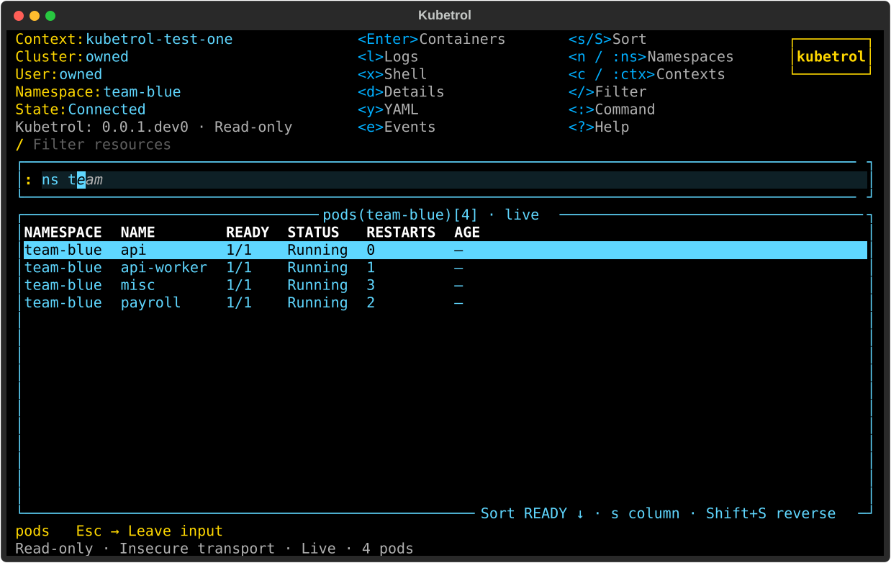
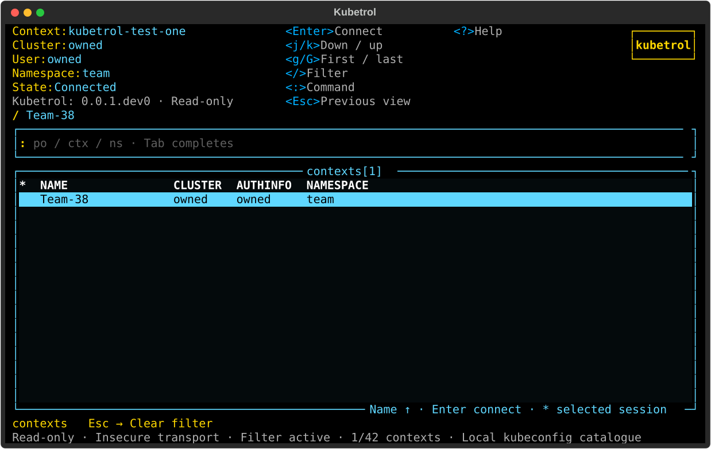
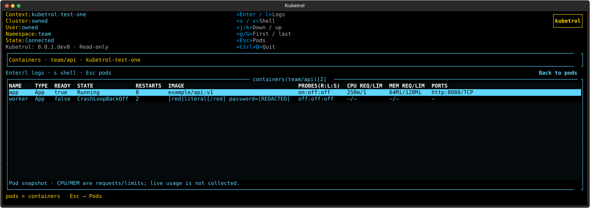

# Bordered commands, workspace contexts and container details

[Issue #129](https://github.com/carloshm91/kubetrol/issues/129) and
[PR #130](https://github.com/carloshm91/kubetrol/pull/130) implement the latest
preview feedback with original Python/Textual code. The dedicated command bar
has a rectangular border and keeps inline suggestions. Contexts are normal
workspace rows; containers expose useful captured specification/status values.
See [behavior and limitations](../resource-workspace.md) and
[the current trial](../first-preview.md).

## Actual UI captures







These are actual Pilot renders from the complete passing Python 3.12 matrix,
using synthetic owned API fixtures. Private reference images and operator
cluster data are not distributed.
Repository copies normalize whitespace-only XML lines for whitespace checks.

## Delivered behavior

Bare `:ctx`, `:context`, `:contexts`, `c` and F2 show the local context table.
Columns identify the exact context name, cluster/auth-info aliases, default
namespace and selected session (`*`). Filtering and browsing use the already
loaded catalogue without starting authentication helpers or rewriting kubeconfig;
an already-owned resource watch remains active. Enter connects to the exact
selected name and opens pods. Escape/history restore the preceding view's
query, cursor and viewport. Failed/delayed connections retain existing owned
cancellation and recovery behavior.

Scoped `:ns NAME`, `:ns *` and `:po NAME` commands clear the context query in
the pod view while retaining it for later context browsing. The Escape
destination follows the active view, including after leaving contexts.

At a fixed terminal size the header, interaction region, main frame and footer
retain their boundaries across implemented pod/namespace/context/container/log
routes and input focus. Ordinary terminals show the command rectangle; below
16 rows, side borders leave usable content at 40×12. Tests exercise 40×12,
60×18, 100×30 and 180×50, mouse clicks, keyboard navigation and resize round trips.

Container columns show name/type, ready, state/reason, restarts, image, configured
readiness/liveness/startup probes, CPU/memory requests/limits and declared ports.
Regular/init/sidecar statuses match by name. Missing or malformed optional data
stays explicit; strings/ports are bounded and literal text is sanitized/redacted.
Enter still opens that container's logs; embedded shell targets and UID guards
retain their existing ownership.

## Frozen local qualification

All three full matrices finished with **exit 0** on candidate
`73c59536d41bf77728e3bf3263e1ebc90b41e02b`. Each used its own checkout/venv and explicit uv
interpreter selection. Application/tests/scripts stayed fixed for every run:

- Application: `f1859cf9b1d9b7ab78afa157c4a6c3a6c143accf`.
- Tests: `0dd2558588c7465e7efc45cf85fffbbbc0d6c096`.
- Scripts: `7ea6a80933d9f4c4042dd33ebb4a5bc667552f84`.

Base: `2e41adab2e2fecc795feed1293bcd292eff7d2d9` (PR #128).
Environment: Linux x86_64, Textual 8.2.8, kubernetes-asyncio 36.1.0,
Pyte 0.8.2. Coverage counts all production modules, including unimported code.

| Linux interpreter | Full suite | Production lines | Production branches | Changed executable lines |
| --- | ---: | ---: | ---: | ---: |
| CPython 3.12.12 | 1,616 passed | 6,004/6,031 (99.55%) | 1,704/1,744 (97.71%) | 252/252 (100.00%) |
| CPython 3.13.12 | 1,616 passed | 6,004/6,031 (99.55%) | 1,704/1,744 (97.71%) | 252/252 (100.00%) |
| CPython 3.14.3 | 1,616 passed | 5,897/5,924 (99.54%) | 1,704/1,744 (97.71%) | 238/238 (100.00%) |

Each minor passes Ruff, formatting, strict mypy over 72 sources, planning
validation, the full unit/API/UI/quality/terminal/package suite, independent
coverage and changed-line gates, wheel/sdist builds and Twine metadata checks.
All **27 critical deterministic modules** reach 100% lines and applicable
branches, including the new container projection. No exclusions or lowered
gates were introduced. Packaging trials exercise fresh-installed console/module
entry points outside the checkout and rebuild the source distribution.

Each matrix retains **54 actual behavioral UI SVGs and 62 real PTY records**.
Python 3.12 additionally retains five owned-kind UI captures. The terminal
trials cover real context table Enter/Escape, inline completion, logs, embedded
shells, Unicode, resize and terminal restoration.

The complete recipe is `/tmp/kubetrol-129-evidence/matrix.sh`, following
[quality policy](../quality.md), invoked with explicit `3.12`, `3.13` and `3.14`.
Raw logs, coverage JSON/XML, changed-line JSON, distributions and UI/PTY artifacts
are retained in `/tmp/kubetrol-129-evidence`, with measured `summary.json`.

## Regression and earlier-candidate evidence

A real-terminal fixture initially asserted both context headers before the
terminal had delivered the complete header. It now waits for AUTHINFO before
asserting NAME/CLUSTER on the same row. Separately, scoped-command regressions
reproduced a context query leaking into pods and an obsolete context Escape
destination; both fail before their corrections and pass afterward.
Earlier candidate successes, failures and superseded interrupted matrices are
retained separately. They are not counted as final-candidate qualification.

## Real Kubernetes and shell trials

Both owned kind scripts finished with **exit 0** on the same final application/
script trees above. kind 0.33.0 and matching kubectl 1.36.4 use pinned Kubernetes
1.36.4 node and shell image digests recorded in the evidence JSON.

```sh
uv run --locked --python 3.12 python -m scripts.verify_contexts_kind \
  --kind /tmp/kubetrol-tools/kind \
  --evidence /tmp/kubetrol-129-evidence/kind-contexts
uv run --locked --python 3.12 python -m scripts.verify_shell_kind \
  --kind /tmp/kubetrol-tools/kind \
  --kubectl /tmp/kubetrol-tools/shell/bin/kubectl \
  --evidence /tmp/kubetrol-129-evidence/kind-shell
```

The actual context workspace verifies its selected marker and frame, filters a
local context, executes `:ns kube-system` without query leakage, restores the
context query and reconnects through Enter with a distinct owned client. Real
CoreDNS rows verify running state/image and declared CPU requests/ports. Existing
namespace LIST/WATCH create/delete, discovery, pagination, quiet watch renewal,
inspection, logs, history and cleanup trials also pass.

Shell trials cover two-container selection, default/configured shells, BusyBox
vi, resize/Ctrl+C/repeated return, missing shell, real pods/exec RBAC denial,
terminal restoration and pinned prepared connections. Each script deletes its
own fixtures and cluster; no operator context is used.

## Delivery limits

Container values come from the captured pod snapshot; reopening refreshes them.
CPU/memory columns show configuration, not live usage. Live container refresh
remains #41, live metrics #68, and ephemeral debugging #78. Broader resource
tables, inspection layout, nested command routing and configurable hotkeys remain
#41/#53/#61/#57. This issue does not establish full K9s parity.

Hosted jobs cannot start under the account payment/spending-limit restriction;
the PR records their actual zero-step failures and DCO result. Local Linux
results do not qualify macOS. Delivery follows the maintainer-authorized
[temporary workflow](../quality.md#temporary-private-development-workflow-when-actions-is-unavailable).
Full supported platform CI remains required before public release.

No tag, GitHub Release, package publication or visibility change is made.
The installed version remains `0.0.1.dev0`; publishing automation and the first
qualified release remain #36/#40 under [the release procedure](../releases.md).
