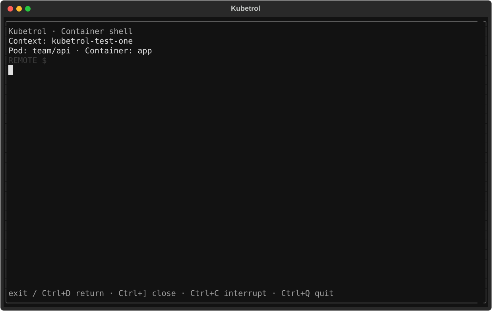

# Embedded container shell: feedback #121

[Issue #121](https://github.com/carloshm91/kubetrol/issues/121) and
[PR #122](https://github.com/carloshm91/kubetrol/pull/122) deliver the clarified UX:
the remote prompt lives inside a full-screen Textual terminal with a persistent
captured-target frame. The default shell route does not suspend Textual.



The image is a real Pilot-rendered screen with an actual PTY child and synthetic
owned API data. It contains no maintainer cluster or credentials. Actual source,
installed-package and Kubernetes trials qualify the interactive behavior below.

## Frozen qualification

All three complete local matrices and the owned-kind trial finished with exit 0
on commit `7c76597f013ec3c3a309366932f7d4de02c948dd`. Source/tests/scripts were not edited during those
runs. Later acceptance/roadmap updates preserve these tested trees:

- Application: `0014d5eee5aa58ef7670dbac3851cbb1685e4c01`.
- Tests: `42948f48949c6a31d157be8001669e48e8b07e5c`.
- Verification scripts: `21f2253efad9486600d4ac4232f4844498b16629`.

Environment: Linux x86_64, Textual 8.2.8, Pyte 0.8.2, wcwidth 0.9.2;
Python versions below. Each minor used its own checkout/venv and explicit
`uv --python` selection. This is local Linux evidence, not a macOS result.

| Python | Full suite | Lines | Branches | Changed lines |
| --- | --- | --- | --- | --- |
| 3.12.12 | 1554 | 5408/5429 (99.61%) | 1541/1570 (98.15%) | 466/466 (100.00%) |
| 3.13.12 | 1554 | 5408/5429 (99.61%) | 1541/1570 (98.15%) | 466/466 (100.00%) |
| 3.14.3 | 1554 | 5321/5342 (99.61%) | 1540/1570 (98.09%) | 466/466 (100.00%) |

All **25 critical deterministic modules** meet 100% lines and applicable branches,
including keyboard/paste/geometry decisions. No coverage exclusions were added.
All matrices pass Ruff, formatting, strict mypy, repository planning checks,
behavioral/contract/UI/quality/terminal/package tests, independent coverage gates,
wheel/sdist builds and Twine validation. Package tests rebuild the sdist and run
fresh-installed console/module entry points outside the checkout.

Each minor retains **37 actual UI SVGs and 62 actual PTY trials**, including
22 selected-container console/module scenarios, fresh-installed shell use,
normal/failed exits, missing kubectl/image shell, read-only/deleted targets,
Ctrl+C, local Ctrl+] close, Ctrl+Q during exec, SIGTERM and full-screen curses
resize. Every PTY restoration summary compares actual before/after termios,
checks alternate-buffer closure/cursor restoration and disabled reporting modes.
Pilot/contract tests additionally exercise Unicode/bracketed paste, remote `q`,
`:`/`/`/Escape/Tab/arrows, scope/UID invalidation, repeated sessions, partial I/O,
backpressure, startup cancellation and process/file/descriptor cleanup.

Two discovered edge cases have regressions: closing before the screen mounts
must prevent preparation/launch, and unsupported/malformed CSI arity must not
abort the app. Host control strings, saved-cursor state and combining cells are
bounded independently of the screen dimensions.

Reproduce the gates listed in [quality policy](../quality.md) in separate
checkouts with `uv sync --locked --group dev --python 3.12` (and 3.13/3.14);
pass the same explicit `--python` to subsequent uv commands. Use
`pytest --cov=kubetrol --cov-branch --cov-report=xml --cov-report=json`,
`check_coverage.py`, and `diff-cover --compare-branch origin/main --fail-under 90
--total-percent-float` against the PR base. Full logs, coverage JSON/XML,
changed-line reports, distributions and UI/PTY artifacts are archived locally at
`/tmp/kubetrol-121-evidence/summary.json` and its per-minor directories.

## Actual Kubernetes and input qualification

```sh
uv run --locked --python 3.12 python -m scripts.verify_shell_kind --kind /tmp/kubetrol-tools/kind --kubectl /tmp/kubetrol-tools/shell/bin/kubectl
```

The script creates/deletes its own kind 0.33.0 cluster using pinned Kubernetes
1.36.4 and Alpine image digests, with matching kubectl 1.36.4. Its four trials
pass: default/configured shell, missing image shell and real pods/exec RBAC denial.
They verify chosen app-b container, explicit alias/namespace, prepared credentials
remaining pinned after changing only the owned source kubeconfig, shell size,
Ctrl+C interruption, repeated return and terminal restoration.

The actual BusyBox `vi` opens within the frame, resizes to the corresponding
child dimensions (status row 27 at host 100×30 and row 22 at 80×25), accepts an
edit, saves/quits and returns to the shell. A subsequent `cat` verifies the real
owned file contents. These assertions inspect emulated host-screen cells rather
than treating raw cursor-control bytes as visible text. The cluster and all
fixtures are deleted in the script's final cleanup. Kind and four PTY records
are archived under `/tmp/kubetrol-121-evidence/kind`; no operator context is used.

A point-in-time `pip-audit --no-deps --disable-pip` of the complete locked runtime
export found no known vulnerabilities. JSON evidence is retained in the archive.
This is not the full Q04 SBOM/license/provenance automation or a safety guarantee.
Pyte's unmodified LGPLv3 dependency is documented in [shell behavior](../container-shell.md).

## Delivery limits

Hosted Actions cannot start under the account payment/spending-limit block;
recorded source-head jobs have zero executed steps, and DCO passes. Final PR-head
metadata is recorded before merging under the maintainer-authorized temporary
[local workflow](../quality.md#temporary-private-development-workflow-when-actions-is-unavailable).
Hosted failures remain failures. macOS/SSH/tmux qualification remains Q02 and
full platform CI; a public release still requires its complete qualification and
explicit publication authorization.

This screen supports the documented shell keys, bounded Unicode paste, terminal
colors, cursor modes/reports and alternate buffers. Scrollback/search/copy is
tracked in [#123](https://github.com/carloshm91/kubetrol/issues/123); mouse and
advanced input protocols in [#124](https://github.com/carloshm91/kubetrol/issues/124).
It does not claim universal terminal-program compatibility or full K9s parity.
Repository visibility, version `0.0.1.dev0`, publication and tags are unchanged.
