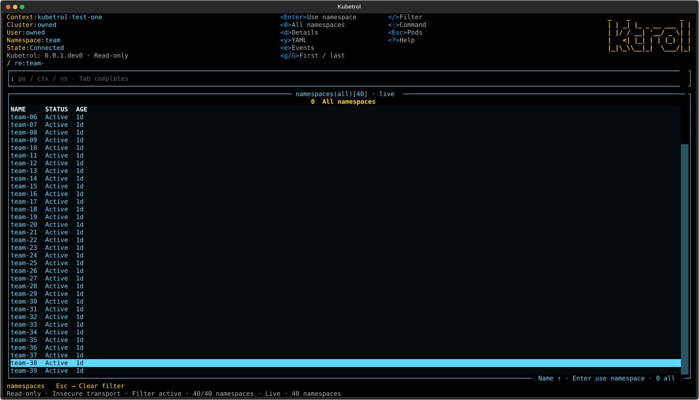

# Responsive ktrol header logo

Maintainer refinement [#132](https://github.com/carloshm91/kubetrol/issues/132)
uses an original five-row ASCII `ktrol` mark in the shared upper-right header.
At 70–119 columns a small wordmark preserves shortcut space; the full mark uses
22×5 cells from 120 columns. Narrow/short/headless/logoless presentations retain
their visibility rules. Kubetrol remains the project/package/CLI name and the
installed version remains `0.0.1.dev0`.

This is an actual passing Pilot render over an owned loopback API with synthetic
namespaces. Private reference images are not included. Existing route tests check
pods, namespaces, contexts, containers and logs, stable frames and header columns,
mouse/focus controls and resize round trips. Layout goldens include the 120-column
logo breakpoint. Real CLI PTYs resize 100→120→50 columns, require the full mark
and namespace/help shortcuts, and verify q/Ctrl+Q/Ctrl+C restoration. Launch-option
cases resize 140→100→40 columns while retaining hidden widgets and read-only guards.

## Resize failure and correction

Initial candidate `9fafa2d070d770c355f749803923398dce6bc143` passed 1,743 tests and
all gates on Linux/Python 3.13 and 3.14. Its Python 3.12 run failed one PTY case
(1,742 passed); that result is retained and is not passing qualification.
The screenshot showed hints formatted for 61 cells after the logo had reduced the
actual panel to 49 cells. Namespace text wrapped and later shortcuts were clipped.

A controlled late-logo-width change reproduces the failure without timing sleeps:
the outer header stays the same size while hint rows remain 60 cells in a
49-cell panel. `ViewActions` now owns reflow on its own
[non-bubbling Resize event](https://textual.textualize.io/events/resize/).
The same reproduction now yields 48-cell rows, keeping namespace/help hints
visible. The regression test and original PTY assertions remain enforced.

## Frozen qualification

Candidate: `9efd53a8f239d12b718d913463488ef6a21a9fbc`.
Application, tests and scripts stay fixed throughout the complete runs:

- Application tree: `4e89c8480782dc3307d0f69e316be0005733064f`.
- Test tree: `bb261cea324004a0619f78368cadd597a2a31513`.
- Script tree: `73039917da9953c6a4753d45f6a4a95368f5b3dd`.

| Linux interpreter | Tests | Production lines | Production branches | Changed executable lines |
| --- | ---: | ---: | ---: | ---: |
| CPython 3.12.12 | 1,744 passed | 6,146/6,172 (99.58%) | 1,769/1,808 (97.84%) | 35/35 (100%) |
| CPython 3.13.12 | 1,744 passed | 6,145/6,172 (99.56%) | 1,768/1,808 (97.79%) | 35/35 (100%) |
| CPython 3.14.3 | 1,744 passed | 6,038/6,065 (99.55%) | 1,768/1,808 (97.79%) | 35/35 (100%) |

All three complete runs finish with exit 0 and each retains 57 actual UI SVGs
and 64 real PTY restoration records.
Each complete run passes Ruff/format, strict mypy over 73 sources, planning
validation, full behavioral/real-PTY/fresh-install tests, independent production
line/branch gates, all 28 critical modules at 100%, changed-line gates, wheel/sdist
builds and Twine metadata checks. No coverage exclusions or lowered gates were
introduced. Later commits add documentation/evidence only; the application/test/
script trees remain unchanged.

Exact commands follow [quality policy](../quality.md) and are retained in
`/tmp/kubetrol-132-evidence/matrix.sh`. Raw logs, coverage, changed-line reports,
UI renders, terminal restoration records and candidate packages are retained
under `/tmp/kubetrol-132-evidence`, including the initial failed trial and the
negative/positive resize controls. No additional cluster integration run is
claimed for this presentation change.

## Delivery limits

Hosted jobs remain unavailable under the account quota/billing restriction;
the PR records current-head jobs and DCO. Local Linux qualification does not
establish macOS. Delivery follows the maintainer-authorized temporary workflow
in [quality policy](../quality.md#temporary-private-development-workflow-when-actions-is-unavailable).
No package/release is published. Broader themes/about/update notices remain #56;
Tab/click focus feedback remains #61, without a full-parity claim.
