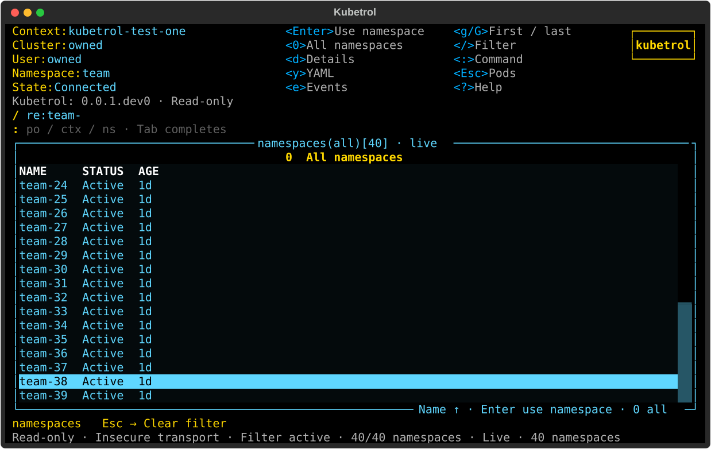
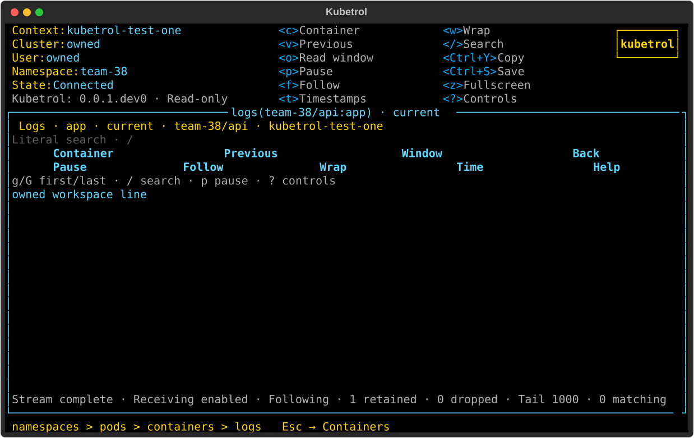

# Resource workspace: preview feedback #125

[Issue #125](https://github.com/carloshm91/kubetrol/issues/125) delivers an original
Python/Textual workspace inspired by the maintainer's K9s layout references.
Private reference images and their cluster data are not distributed.

[PR #126](https://github.com/carloshm91/kubetrol/pull/126) implements the preview.





These are actual Pilot-rendered screens with synthetic owned API data, not design
mockups or maintainer reference images. Real Kubernetes trials qualify the
corresponding API behavior below.

## Delivered behavior

The built-in `k9s` theme, shared identity/version/shortcut header, top command and
filter inputs, and Escape trails apply to pod/namespace/container/log navigation.
Namespaces use real owned LIST/WATCH objects and UID selection, not a scope
picker. Enter opens pods; Escape restores the namespace query/selection/viewport;
`0` selects all pods. Existing embedded shell ownership and target framing remain.

Actual Pilot/API trials exercise 40×12, 60×18, 100×30 and 180×50 layouts,
namespace lifecycle/age, filtering, g/G, watch recreation, permission denial,
stale/empty states, bounded patch cancellation and late context results.
Real PTY and fresh-installed trials qualify rapid command typeahead,
namespace/pod routes, focus, Unicode, resize and terminal restoration.
Short trails prioritize the visible Escape destination; container errors wrap
in a bounded scrollable area. Command submission applies its navigation decision
before subsequent raw typeahead. Returning within the same context reuses its
owned client instead of authenticating again.

## Frozen local qualification

All three complete matrices finished with **exit 0** on commit
`b04e0800e4d9f9c0423b74fb4ca3bd4ee2b820e2`. Application/tests/scripts were not edited
during these runs. Later acceptance updates preserve the tested trees:

- Application: `d928da1aac2868a7ee713e43b5576d9dc6b0a163`.
- Tests: `0ea254b2007c61588ad1e27912279aa1c387275c`.
- Verification scripts: `254ff9e9a7a508e0a47aea90046467632b314757`.

Environment: Linux x86_64, Textual 8.2.8, kubernetes-asyncio 36.1.0, Pyte 0.8.2.
Each minor used a separate checkout/venv and explicit uv interpreter selection.

| Python | Full suite | Lines | Branches | Changed lines |
| --- | --- | --- | --- | --- |
| 3.12.12 | 1574 | 5758/5784 (99.55%) | 1621/1658 (97.77%) | 429/432 (99.31%) |
| 3.13.12 | 1574 | 5758/5784 (99.55%) | 1621/1658 (97.77%) | 429/432 (99.31%) |
| 3.14.3 | 1574 | 5665/5691 (99.54%) | 1621/1658 (97.77%) | 422/425 (99.29%) |

All **26 critical deterministic modules** reach 100% lines and applicable
branches, including the namespace lifecycle/identity projection. No exclusions
or lowered gates were added. Ruff, formatting, strict mypy (70 sources), planning
validation, behavioral/API/UI/quality/terminal/package tests, independent coverage
gates, wheel/sdist builds and Twine validation pass for every minor.

Each matrix retains **45 actual UI SVGs and 62 actual PTY records**, including
fresh-installed console/module use outside the checkout. Namespace Enter/Escape,
filter/all scope, top completion, Unicode, resize and terminal restoration run
through actual CLI processes. The owned API deliberately holds the namespace
probe during connection establishment while the UI remains interactive;
namespace selection is rejected while connecting
and succeeds after a real connection completes. UI tests wait for displayed
403/stale state as well as the backend observation. This avoids treating an older
`Live` label or an unrendered state change as readiness.

Reproduce the complete commands in [quality policy](../quality.md), with
`uv sync --locked --group dev --python 3.12` (and 3.13/3.14) and the same explicit
`--python` on subsequent uv commands. Run full branch coverage, the independent
coverage script and diff-cover against the PR base `b9ccfe5d395c535e013c2a2f780ef10ecd5ae5c7`.
Full logs, coverage XML/JSON, changed-line reports, built distributions and UI/PTY
artifacts are archived locally at `/tmp/kubetrol-125-evidence/summary.json` and its
per-minor directories. Earlier failed/interrupted attempts are retained separately
and are not counted as successful qualification.

## Real Kubernetes and shell trials

```sh
uv run --locked --python 3.12 python -m scripts.verify_contexts_kind --kind /tmp/kubetrol-tools/kind
uv run --locked --python 3.12 python -m scripts.verify_shell_kind --kind /tmp/kubetrol-tools/kind --kubectl /tmp/kubetrol-tools/shell/bin/kubectl
```

Both scripts finished with **exit 0** on `9f60509e2d37741c9afce2c7bb07cc0ced43698b`,
whose application/script trees equal the final matrix trees above. Later changes
before the matrices adjust test synchronization only. Owned kind 0.33.0 uses
pinned Kubernetes 1.36.4 images; shell verification uses matching kubectl.

The actual namespace widget verifies real UID/Active columns, watches creation
and deletion of a uniquely owned namespace, selects `kube-system` for pods,
returns with the same namespace UID and opens all pods. The script also verifies
real discovery, pagination, watch renewal, pod columns, inspection, containers,
logs and history. The shell script passes four trials: default/configured shell,
missing image shell and actual pods/exec RBAC denial. BusyBox vi editing/save,
resize, Ctrl+C, repeated return and terminal restoration remain qualified with
the new parent workspace. Each script deletes its own fixtures and cluster.
Evidence is under `/tmp/kubetrol-125-evidence/kind`; no operator context is used.

## Scope and delivery limits

The displayed version comes from the installed package. Real optional release
notices and custom/live themes remain #56; Kubernetes-version/CPU/memory display
remains #68/#69. Inline completion was deferred at this checkpoint; the later
[correction #127](stable-workspace.md) records its implementation and stable
geometry qualification. Broader terminal qualification remains #61.
This does not establish full K9s parity or universal terminal compatibility.

Hosted application and repository jobs cannot start under the account
payment/spending-limit block: their recorded jobs execute zero steps, while DCO
passes. Their failure status is preserved. Linux local
qualification follows the maintainer-authorized [temporary quality workflow](../quality.md#temporary-private-development-workflow-when-actions-is-unavailable).
macOS and full platform CI remain required before a public release.
Visibility, package publication, version `0.0.1.dev0` and tags are unchanged.
