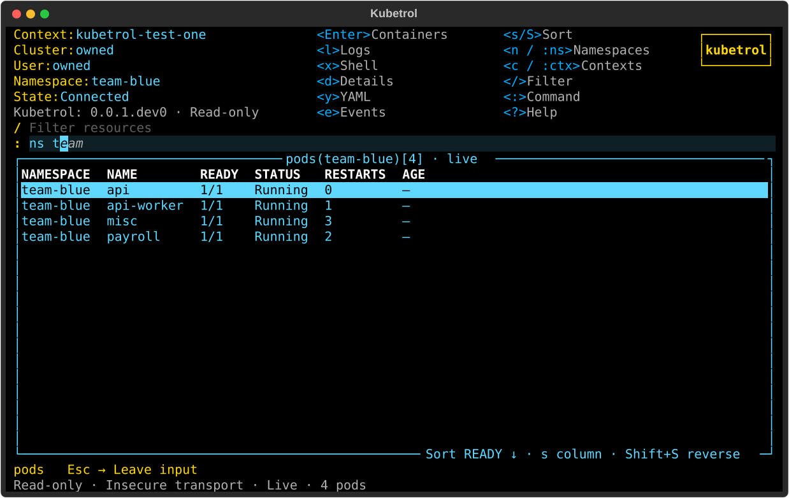
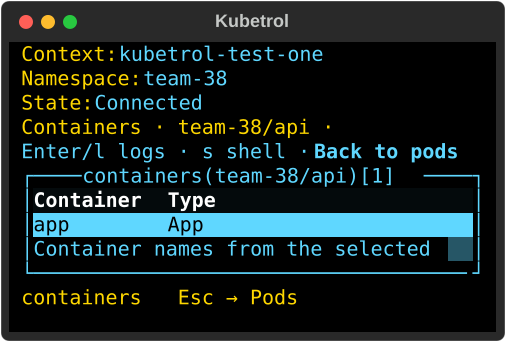
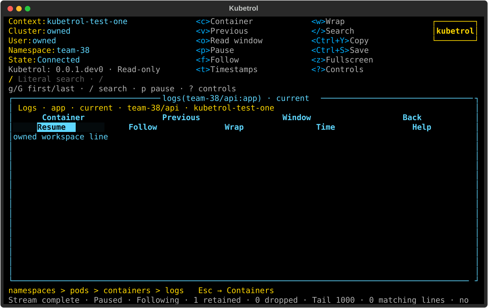

# Stable workspace and inline command bar

Focused preview correction [#127](https://github.com/carloshm91/kubetrol/issues/127)
supersedes the earlier dropdown preference in B07. The original Python/Textual
implementation keeps identical frame boundaries and header columns across pods,
namespaces, containers and logs at a fixed terminal size. The dedicated `:` bar
uses a styled inline completion suffix; there is no overlay.

Pilot tests assert actual regions across the full route at 40×12, 60×18, 100×30
and 180×50, including mouse focus/Pause clicks, resize round trips, search,
fullscreen and Escape. Existing navigation tests cover literal Enter versus
deliberate cycling/Tab, cached suggestions without per-key requests, stale
scope/context choices, history and retained UID selection/viewport.

The implementation uses the pinned native Textual Input suggestion renderer
through a narrowly documented field boundary. Empty input keeps its placeholder;
long suffixes display only within the available width. Broader resource
navigation and configurable hotkeys remain #61/#57.

## Actual UI captures







These are actual Pilot renders from the complete passing Python 3.12 matrix,
using owned synthetic API data. Reference screenshots remain local/private.

## Frozen qualification

Candidate commit: `affa529c1112ce6607e3a418b7bcad6092f5dade`.
The following source/test/script trees stay fixed throughout each complete run:

- Application: `427286d4909b4be4a4cbae9c1f4129f04ebe5070`.
- Tests: `8683cbb1373891d4e4da4fb68b4f39433c4b8ae8`.
- Scripts: `254ff9e9a7a508e0a47aea90046467632b314757`.

| Linux interpreter | Tests | Production lines | Production branches | Changed executable lines |
| --- | ---: | ---: | ---: | ---: |
| CPython 3.12.12 | 1,581 passed | 5,777/5,803 (99.55%) | 1,627/1,664 (97.78%) | 55/55 (100%) |
| CPython 3.13.12 | 1,581 passed | 5,777/5,803 (99.55%) | 1,627/1,664 (97.78%) | 55/55 (100%) |
| CPython 3.14.3 | 1,581 passed | 5,684/5,710 (99.54%) | 1,627/1,664 (97.78%) | 55/55 (100%) |

All three complete matrices finished with exit 0. Each passes after Ruff, format checking, strict mypy over
70 sources, planning validation, the full behavioral/terminal/install suite,
independent coverage gates, 100% for all 26 critical modules, changed-line gates,
wheel/sdist builds and Twine. Each produces 49 actual UI SVGs and 62 real PTY
restoration records. Both platforms and all release checks still require hosted
qualification before public release.

Run the exact commands with an explicit interpreter using
`/tmp/kubetrol-127-evidence/matrix.sh`, which follows [quality policy](../quality.md).
Raw logs, coverage JSON/XML, changed-line reports, distributions and captures are
retained under `/tmp/kubetrol-127-evidence`.

## Fixture corrections and initial results

The initial candidate `37c44af121ff6a51c183f1d1b244110f49f67895` passed all
1,581 tests and gates on Python 3.14. Initial 3.12/3.13 runs failed and are
retained separately; they are not counted as final successful qualification.
The original resize fixture printed from SIGWINCH while stdout was flushing.
An isolated repeated trial reproduced Python's buffered-stdout reentrancy error.
The child now records the signal and prints its real geometry in normal execution,
from an owned temporary script; literal-argument validation remains unchanged.

The initial quiet-preview trial timed out waiting for three renewals on the
contended host with a 250 ms ordinary-request budget. That UI trial now allows
one second for headers while
retaining real one-second server expiry, unchanged no-stale/live/checkpoint
assertions and the same bounded completion wait. The transport contract still
qualifies a one-second quiet body with a 100 ms ordinary request deadline in
`tests/contract/test_watches.py`. The corrective commit changes fixtures only;
the application/scripts trees and independent coverage gates are unchanged.

## Real Kubernetes and terminal behavior

Both owned kind scripts completed with exit 0 on the identical application and
script trees at the initial candidate. They qualify real discovery, namespace
LIST/WATCH create/delete and UID rows, scope/history navigation, inspection,
container/log selection, quiet renewal and cleanup. Shell trials qualify default/
configured shells, BusyBox vi, resize/Ctrl+C/repeated return, missing shell, real
pods/exec RBAC denial, terminal restoration and prepared connection pinning.
Each script deleted its own fixtures/cluster; no operator context was used.

```sh
uv run --locked --python 3.12 python -m scripts.verify_contexts_kind \
  --kind /tmp/kubetrol-tools/kind \
  --evidence /tmp/kubetrol-127-evidence/kind-contexts
uv run --locked --python 3.12 python -m scripts.verify_shell_kind \
  --kind /tmp/kubetrol-tools/kind \
  --kubectl /tmp/kubetrol-tools/shell/bin/kubectl \
  --evidence /tmp/kubetrol-127-evidence/kind-shell
```

## Delivery limits

Hosted jobs cannot start under the account payment/spending-limit restriction.
The PR records actual zero-step jobs and DCO status; local Linux results do not
qualify macOS. Delivery uses the maintainer-authorized temporary workflow in
[quality policy](../quality.md#temporary-private-development-workflow-when-actions-is-unavailable).
Context/inspection layout and command routing in nested views remain explicitly
queued in #61; broader resource tables, configurable keys, update/theme controls
and metrics remain #41/#53/#57/#56/#68/#69. This correction covers the implemented
pod/namespace/container/log path, without a full-parity claim.
