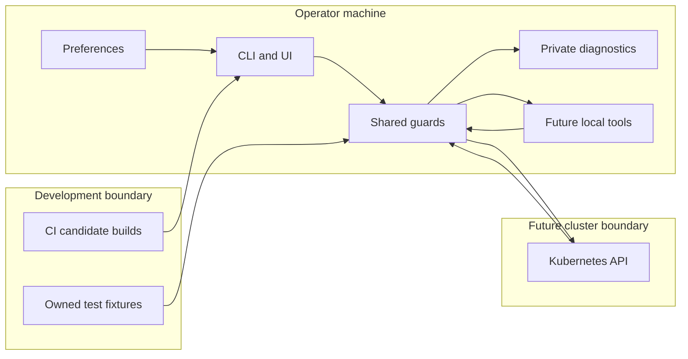

# Kubetrol threat model

**F04 #18, context validated on 2026-10-04.** The maintainer chose the K9s-style
local execution model: trusted kubeconfig authentication helpers and deliberately
invoked local plugins run with the launching user's privileges, without an
application sandbox. See the [decision and upstream evidence](security-primitives.md#local-execution-model).

## Executive summary

The highest prospective risks are exposing Kubernetes credentials, acting on a
different cluster/object than the operator selected, and giving unexpected local
execution authority to configuration or plugins. Cluster text can also attack
terminal integrity and availability. Current runtime behavior is a disconnected
local UI with private diagnostics; Kubernetes transports, delegated commands,
plugins and publishing workflows are planned. F04 implements presentation,
argument and target primitives plus test isolation. F05 stage 1 adds shared
read-only command decisions and pre-I/O unavailable gates. Remaining risks require
enforcement at the future adapters/services, not just reusable helpers.

## Scope and assumptions

- Runtime: `src/kubetrol` CLI, preferences, diagnostics, UI, F04 helpers and F05
  local launch/access services.
- Development: `tests`, `scripts`, `.github/workflows`, `pyproject.toml`, `uv.lock`
  and the planned release contract in `docs/releases.md` are modeled separately.
- Deployment is a local Linux/macOS terminal, including a terminal reached over
  SSH. There is no hosted server, shared tenant backend or telemetry service
  (`docs/architecture.md`, Product boundary; `cli.main`; `ui.launch.run_terminal`).
- Operator kubeconfig, executable selection and plugin installation are trusted
  local decisions. Cluster fields/logs are untrusted. Kubernetes RBAC governs API
  authority; a read-only preference is a convenience guard, not a security sandbox
  (`SECURITY.md`; `docs/architecture.md`, Authentication and delegated tools).
- Tests use generated credentials or owned disposable clusters. F04 makes no API
  requests. Real-cluster performance, SSH transport security and compromised
  operating systems/Kubernetes control planes are outside implementation scope.

The local execution context question is resolved. Authentication helpers may run
automatically for the chosen trusted kubeconfig, including credential renewal;
ordinary plugins require operator invocation. This distinction must be preserved
in C01/U03. Cloud-helper compatibility, write policy and release trust remain
qualification questions for their linked issues; their absence is not described
as a current exploitable service. An isolation requirement or unattended/hosted
deployment would require a new model and reconsideration of TM-004.

## System model

### Primary components

| Component | Evidence and current status |
| --- | --- |
| Local CLI/UI | `cli.main`, `ui.app.KubetrolApp`, `ui.launch.run_terminal`; real disconnected terminal, no SDK loader/client |
| Local preference files | `config.store.read_config`/`write_config`, `config.schema.Settings`; bounded schema and private atomic writes |
| Diagnostics | `diagnostics.logging.diagnostic_logging`/`SanitizedFormatter`, `diagnostics.redaction.sanitize_text`; owned private bounded log files |
| Shared security/domain helpers | `security.presentation.safe_text`, `security.arguments.freeze_arguments`, `domain.targets.ResourceTarget`; implemented, future cluster sinks/services must integrate them |
| Launch/access decisions | `config.launch.require_available`, `services.access.AccessPolicy`, `services.commands.CommandService`; pre-I/O availability errors and shared CLI/UI read-only requests; actual API/process effects absent |
| Kubernetes and process adapters | Planned in `docs/architecture.md`, C01/C04/S03/M01/U03; per-session client, kubectl/editor/plugins, lifecycle ownership |
| Build/CI/install | `.github/workflows/quality.yml`/`repository.yml`, `pyproject.toml`, `uv.lock`; candidate builds/tests exist, publishing/provenance are planned in `docs/releases.md` |

### Data flows and trust boundaries

- Operator → CLI/preferences → application: local argv/environment/files; owned
  CLI errors and F03 bounded YAML/schema validation. Files are operator controlled;
  mode 0600/atomic writes protect ordinary local confidentiality/integrity
  (`cli._Parser`, `config.store`, `config.schema`).
- Future cluster → adapter → display/log sink: HTTPS API/watch/log data using
  explicit per-session credentials and verified TLS by design; API identity and
  RBAC do not make response text safe. `safe_text` provides bounded literal Rich
  text, redaction and inert controls; transport/queue limits remain C04/S02 work.
- Operator kubeconfig → future credential helper: local parsing/subprocess,
  helper execution with user privileges. Trust is established by deliberate local
  config choice, not a confirmation on every credential refresh. Never import
  helpers from cluster data
  (`docs/architecture.md`, Authentication and delegated tools). Kubernetes
  [warns that untrusted kubeconfigs can execute code](https://kubernetes.io/docs/concepts/configuration/organize-cluster-access-kubeconfig/).
- Captured selection → future service → API/command: frozen context/client/UID
  plus explicit argv; guard local staleness and enforce read-only/confirmation/API
  preconditions at service boundary (`ResourceTarget.require_current`; S03/M01).
- Operator plugin configuration → future local executable → application/terminal:
  deliberate invocation, fixed scope and owned processes; user privileges and no
  assumed isolation. Captured UI/log output requires sanitization; interactive
  foreground handoff permits a direct TTY stream and its terminal controls.
  S03 owns this deliberate session boundary and restoration, including remote
  container output. Trusted auth-helper interactive prompts likewise require
  deliberate terminal ownership (`SECURITY.md`; U03/S03/C06/C07).
- PR/dependencies → CI → candidate artifacts → future installer: Git checkout,
  package-index resolution, builds and downloads. Current lock/action pins and
  read-only workflow permissions reduce drift; publishing requires approval,
  immutable bytes and future provenance (`quality.yml`; `docs/releases.md`).
- Test author → fixture loader → local SDK configuration: explicit owned file,
  numeric loopback endpoint, synthetic/disposable credentials, no helper/proxy
  fallback. Ambient loaders are trapped; this is not a network sandbox
  (`tests/conftest.py:isolated_kubernetes`; `tests/support/clusters.py`).

#### Diagram

## Assets and security objectives

| Asset | Why it matters | Security objective (C/I/A) |
| --- | --- | --- |
| Kubernetes credentials/local environment | May grant broad cluster or cloud authority | C: prevent display, logs, exports or unexpected helper/plugin disclosure |
| Cluster resources/action target | Wrong context or recreated object can cause destructive writes | I: bind operation to captured client/UID and API preconditions |
| Terminal/operator decisions | Forged output or invisible identifiers can mislead an operator | I/A: literal safe rendering, stable selection and responsive bounded work |
| Preference/diagnostic files | Local paths can overlap sensitive files; logs carry context | C/I/A: private owned files, no accidental overwrite, bounded storage |
| Package/release bytes | Installation executes application/dependency code | I: reviewed source, immutable verified artifacts and provenance |
| Developer cluster | Tests must never select it by fallback | I/C: explicit owned fixtures and no ambient authentication |

## Attacker model

### Capabilities

A workload author may control log content, annotations and permitted resource
fields encountered by a future browser, without controlling its local machine.
An attacker can offer malicious kubeconfigs/plugins/packages for an operator to
install. A contributor can propose source/workflow changes; a compromised
dependency/action can affect CI and installed code. These are different actors
and require different trust decisions (`docs/architecture.md`; `quality.yml`).

### Non-capabilities

Browsing a cluster does not inherently give a workload author local file writes,
plugin installation or cloud credential access. The current disconnected UI
exposes no network listener/API ingress. A deliberately installed same-privilege
plugin is not separated from user secrets by a claimed sandbox. Kubernetes RBAC
and the local OS remain external authorities (`SECURITY.md`; `ui.app.compose`).

## Entry points and attack surfaces

| Surface | How reached | Trust boundary | Notes | Evidence |
| --- | --- | --- | --- | --- |
| argv/environment/preferences | Operator launch/file | Local config → runtime | Current; reject unsafe input without echoing it | `cli.main`, `config.store`, `config.schema` |
| Exceptions/diagnostic records | Runtime failure | Data → local sink | Current; type/locations without raw exception/source/locals | `SanitizedFormatter`, `KubetrolApp._handle_exception` |
| Resource/log strings | Future API responses | Cluster → terminal | F04 helpers exist; API integration pending | `safe_text`; C04/S02/B04 |
| Selection/action identifiers | Future UI actions | UI → service/API | Immutable snapshot exists; execution enforcement pending | `ResourceTarget`; S03/M01 |
| Kubeconfig exec credentials | Future explicit config load | Local config → process | Trusted operator selection; never cluster supplied | `docs/architecture.md`; C01/C06/C07 |
| Tool/plugin argv and output | Future explicit action | Config/data → process/terminal | No shell interpolation/automatic discovery; interactive TTY admits controls, captured UI output is sanitized | `freeze_arguments`; S03/U03 |
| Test config loaders | Every test family | Test code → SDK/cluster | Traps and qualified escape hatch | `isolated_kubernetes`, `load_disposable_config` |
| Dependency/workflow/artifact changes | PR, build, future install | Source/vendor → runnable code | Candidate checks exist; publishing/security audit pending | `uv.lock`, `quality.yml`; Q04/D04 |

## Top abuse paths

1. Terminal deception → attacker supplies OSC clipboard/link or bidi log text →
   unsafe future sink emits controls → clipboard/display integrity is affected
   (TM-001).
2. Credential disclosure → external error/log includes token or opaque secret →
   raw response/exception is rendered or exported → local log/support material
   exposes cluster authority (TM-002).
3. Wrong-target write → operator confirms a selection then switches context, or
   an object is recreated → service consults live row/name only → different object
   receives the operation (TM-003).
4. Unexpected local execution → attacker offers cluster-derived helper/plugin
   metadata → application imports/discovers it automatically → code runs with
   operator privileges (TM-004).
5. Command confusion → attacker-controlled field becomes a shell string or option
   → future delegated tool changes operation/target → unauthorized local action
   relative to operator intent (TM-005).
6. Availability loss → enormous annotations/log bursts or repeated malformed
   config → unbounded parsing/retention or blocking UI work → terminal freezes or
   excessive storage use (TM-006).
7. Compromised install → dependency/action or published bytes differ from reviewed
   candidate → user installs them → attacker code executes locally (TM-007).
8. Accidental cluster use → fixture setup fails → test falls back to SDK defaults
   or a helper/proxy in the fixture → developer credentials/cluster are used
   without the intended disposable scope (TM-008).

## Threat model table

Priorities below describe residual risk and planned integration requirements,
not claims of exploitable cluster features in the disconnected build.

| Threat ID | Threat source | Prerequisites | Threat action | Impact | Impacted assets | Existing controls (evidence) | Gaps | Recommended mitigations | Detection ideas | Likelihood | Impact severity | Priority |
| --- | --- | --- | --- | --- | --- | --- | --- | --- | --- | --- | --- | --- |
| TM-001 | Workload/resource author | Future API/log view with unsafe sink, or operator-entered interactive session | Inject markup, ANSI/OSC or bidi text | Spoof display/link/clipboard | Terminal decisions | `safe_text`, `escape_controls`; actual Rich rendering tests | Future views must adopt helpers; direct interactive TTY admits controls | B04/S02/U03: literal Text for captured output; S03: document interactive trust and verify restoration | Hostile string UI/PTY regressions | medium once views exist | medium | medium |
| TM-002 | Credential-bearing response or operator data | Sensitive data reaches a display/log/export sink | Leak labeled or opaque credentials | Cluster/cloud credential disclosure | Credentials/logs | `sanitize_text`, `SanitizedFormatter`; fatal UI traceback suppression | Regex cannot identify arbitrary secrets; raw SDK errors/export not implemented | C01/B04/A07: allowlisted errors, concealed Secret defaults, explicit reveal/export policy | Synthetic opaque/labeled secrets across errors and artifacts | medium during adapter expansion | high | high |
| TM-003 | Timing/concurrent cluster changes | A pending future action and client/object change | Redirect action through mutable selection or name reuse | Unintended resource mutation | Cluster integrity | Frozen `SessionIdentity`/`ResourceTarget`, `require_current`; F05 shared command read-only policy | Local guards are not API atomicity/authorization; actual effects absent | C01/M01/S03: bind owned client, reject stale sessions, apply service guard before effects, UID/version preconditions | Delayed confirmations/context switches/object recreation and service-policy tests | medium once actions exist | high | high |
| TM-004 | Malicious offered config/plugin | Operator trust mistake or automatic discovery/import | Execute unexpected helper/plugin | Local code access with user privileges | Credentials/host files | No current execution path; explicit local trust policy in `SECURITY.md` | Future helper/plugin integration; no sandbox assumed | C01/U03: trusted explicit config, no cluster/CWD discovery, deliberate plugin invocation and cleanup | Tests that cluster data never selects executable helpers/plugins; configured auth-helper refresh remains allowed | low with explicit trust; medium if autoimported | high | high |
| TM-005 | Resource/config author | Future command builder treats data as syntax | Shell or option injection | Wrong operation/local execution | Host/cluster integrity | `freeze_arguments`, target control/leading-option checks | Builders/options/process lifecycle absent | S03: fixed argv builder, explicit effective scope, shell-free APIs and tool-specific option handling | Adversarial argv and PTY lifecycle tests | low with fixed builders; medium without | high | high |
| TM-006 | Resource/log author; malformed local file | Future stream accepts unbounded data, or parser limit bypass | Exhaust parsing, queue, render or disk capacity | UI stall/storage exhaustion | Availability | F03 YAML limits/log rotation; F04 display bounds | No live stream queues yet; config file reads happen before UI | C04/S02/Q02: payload/queue/buffer bounds, backpressure and cancellation tests | Soak memory/latency and malformed input fixtures | medium for busy clusters | medium | medium |
| TM-007 | Dependency/action/publishing compromise | Trusted build or release path compromised | Replace runnable package/artifact | Local execution on installation | Release integrity/credentials | Lockfile, action SHA pins, read-only CI, clean installs (`quality.yml`) | No implemented SBOM/audit/provenance/publishing; private plan lacks branch enforcement | Q04/D04: security/license checks, attestation, approved exact-byte publication and protected main | Artifact digest/provenance comparison; install qualification | low but material | high | high |
| TM-008 | Test fallback or unsafe fixture | Test loader reaches ambient or external credentials | Authenticate outside owned fixture | Developer-cluster access | Developer cluster/credentials | `isolated_kubernetes`, qualified bounded fixture loader; refusal and real SDK config tests | Direct HTTP/subprocess/pre-captured aliases need review; kind/helper harness pending | C01/Q01: own cluster cleanup; explicit helper qualification; preserve traps | Negative fixture controls and ambient loader failure | low for trapped loaders | high | medium |

## Criticality calibration

- **critical:** a future automatic, broadly reachable malicious update executes
  code across installations; a future cluster-data path executes local code
  without operator approval using broadly privileged credentials. Neither is a
  demonstrated current path; reach and authority would justify this level.
- **high:** opaque credentials leak in support exports; a confirmed write reaches
  a different privileged context; unexpected helper execution reads host secrets.
- **medium:** attacker log text forges terminal output; sustained log traffic
  freezes a view; a test bypass requires a deliberate unsafe fixture path.
- **low:** a rejected malformed value produces a bounded owned error; oversized
  display text is visibly truncated; safe literal markup merely looks unusual.

High coverage of pure helpers reduces regression likelihood but cannot qualify
unimplemented service/transport behavior. No current threat is ranked critical.

## Focus paths for security review

| Path | Why it matters | Related Threat IDs |
| --- | --- | --- |
| `src/kubetrol/security`, `src/kubetrol/diagnostics` | Display controls, limits, credential policy and error sinks | TM-001, TM-002, TM-005, TM-006 |
| `src/kubetrol/domain/targets.py`, `src/kubetrol/services` and future adapters | Context/client/UID capture, shared policy and future execution enforcement | TM-003, TM-005 |
| `src/kubetrol/config`, future Kubernetes/process adapters | Trusted configuration, TLS/auth, argv and lifecycle | TM-002, TM-004, TM-005, TM-006 |
| `src/kubetrol/ui/app.py` and future resource/log views | Raw output, exceptions and input/selection ownership | TM-001, TM-002, TM-003, TM-006 |
| `tests/conftest.py`, `tests/support/clusters.py` | Ambient credential traps and fixture escape hatch | TM-008 |
| `.github/workflows`, `pyproject.toml`, `uv.lock`, `docs/releases.md` | Build trust and future public artifact approval | TM-007 |

## Notes on use

Review this model when introducing C01 transport/auth, S03 terminal handoff,
M01 writes, U03 plugins and Q04/D04 publishing. Keep evidence tied to implemented
symbols and measured checks. Planned controls are conditional acceptance work,
not completed security guarantees. All fixture credentials are synthetic; no
real kubeconfig or cluster was consulted for this model.
